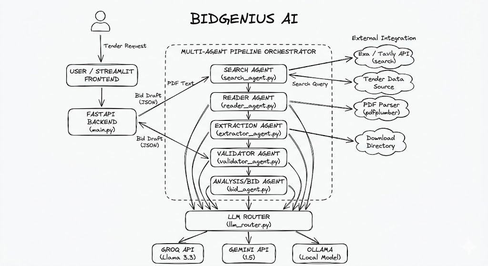
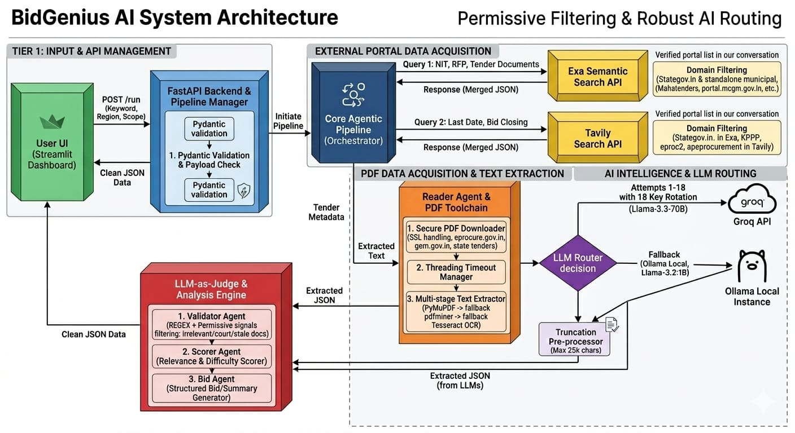

<div align="center">

# 🏛️ BidGenius AI

### Agentic Tender Intelligence Platform

**Automate government tender discovery, analysis, and bid proposal generation using a multi-agent AI pipeline.**

[](https://python.org)
[](https://fastapi.tiangolo.com)
[](https://streamlit.io)
[](https://groq.com)
[](https://tavily.com)
[](https://vercel.com)
[](https://streamlit.io/cloud)

[Live Demo](#-live-demo) · [Problem Statement](#-problem-statement) · [Architecture](#-system-architecture) · [Quick Start](#-quick-start) · [Deployment](#-deployment)

</div>

---

## 📌 Problem Statement

Indian government procurement is a **₹15+ lakh crore annual market** spread across 60+ fragmented procurement portals (eProcure, GeM, state e-tenders, municipal corporations, PSUs). Small and medium enterprises (SMEs) face critical barriers to participation:

1. **Discovery Overload:** Tenders are published across dozens of disconnected portals with no unified search — businesses must manually check each site daily.
2. **Document Complexity:** Tender documents are buried in dense PDFs (often 100+ pages), frequently scanned images, and sometimes in regional languages with Indic numerals.
3. **Time Pressure:** Missing a bid deadline by even one day eliminates the opportunity entirely. Manual extraction of key fields (EMD, fees, dates, scope) takes hours per tender.
4. **Proposal Drafting:** Writing a professional bid proposal requires deep understanding of the tender scope, compliance requirements, and company positioning — typically a multi-day effort.
5. **No Intelligent Filtering:** Businesses waste time reviewing expired, irrelevant, or non-tender documents (court orders, financial reports) mixed into search results.

### Our Solution

BidGenius AI solves this by building a **fully agentic multi-agent pipeline** that automates the complete tender lifecycle — from discovery to bid proposal — in under 5 minutes. The system uses:

- **Dual-source intelligent search** across 60+ government portals
- **Multi-strategy PDF extraction** with OCR fallback for scanned documents
- **Hybrid extraction** (regex-first + single LLM call) for maximum efficiency
- **Automated scoring** on a 100-point bid-fit scale
- **Personalized bid generation** using the company's profile
- **LLM-as-judge evaluation** for proposal quality assurance

---

## 📋 Task Decomposition

The project was decomposed into the following modular tasks, each mapping to a dedicated agent:

| # | Task | Agent | Input | Output | Key Technique |
|---|------|-------|-------|--------|---------------|
| 1 | **Tender Discovery** | Search Agent | Keyword + Region | List of tender URLs | Tavily + Exa dual-source search across 60+ portals |
| 2 | **Document Acquisition** | Reader Agent | Tender URL | Raw text | PDF download with SSL handling + 3-tier extraction |
| 3 | **Field Extraction** | Extractor Agent | Raw text | Structured JSON | Regex-first (20+ patterns) + 1 LLM call for gaps |
| 4 | **Data Validation** | Validator Agent | Extracted JSON | Clean JSON | Type filtering + date sanity + permissive signals |
| 5 | **Scoring & Analysis** | Analysis Agent | Clean JSON | Score (0-100) + Summary | Weighted rubric: completeness + status + quality |
| 6 | **Bid Generation** | Bid Agent | Clean JSON + Profile | 5-section proposal | LLM generation with structured fallback |
| 7 | **Quality Evaluation** | Judge Agent | Proposal + Summary | Rubric scores (1-5) | LLM-as-judge (Groq) with server-side score recomputation |

### Pipeline Flow

```
User Request (keyword, region, company profile)
       │
       ▼
┌─── SEARCH AGENT ──────────────────────────────────────┐
│  Tavily API ──► 60+ portal URLs                       │
│  Exa API    ──► Semantic tender matches                │
│  Merge + deduplicate + time-filter                     │
└──────────────────────────┬────────────────────────────-┘
                           │ List of tender URLs
                           ▼
┌─── READER AGENT ──────────────────────────────────────┐
│  Download PDF (SSL retry, timeout: 15s)                │
│  Extract: PyMuPDF → pdfminer → Tesseract OCR          │
│  Garbage detection (reject garbled/encrypted output)   │
└──────────────────────────┬────────────────────────────-┘
                           │ Raw text (up to 25K chars)
                           ▼
┌─── EXTRACTOR AGENT ───────────────────────────────────┐
│  Regex pass: EMD, fees, dates, org (₹/lakh/crore)     │
│  Single LLM call: fill gaps + classify relevance      │
│  Output: structured JSON with 15+ fields              │
└──────────────────────────┬────────────────────────────-┘
                           │ Structured tender data
                           ▼
┌─── VALIDATOR AGENT ───────────────────────────────────┐
│  Reject: court orders, financial reports, minutes     │
│  Fix: swapped dates, impossible EMD, invalid formats  │
│  Policy: KEEP if uncertain (permissive filtering)     │
└──────────────────────────┬────────────────────────────-┘
                           │ Validated data
                           ▼
┌─── ANALYSIS AGENT ────────────────────────────────────┐
│  Score: Completeness (30) + Status (30) + Quality (40)│
│  Difficulty: Easy / Medium / Hard (EMD thresholds)    │
│  Summary: LLM-generated 3-sentence executive brief    │
└──────────────────────────┬────────────────────────────-┘
                           │ Scored tender + summary
                           ▼
┌─── BID AGENT ─────────────────────────────────────────┐
│  LLM prompt with company profile personalization      │
│  5 sections: Summary, Approach, Team, Timeline, Certs │
│  Fallback: template-based proposal if LLM fails       │
└──────────────────────────┬────────────────────────────-┘
                           │ Bid proposal
                           ▼
┌─── JUDGE AGENT ───────────────────────────────────────┐
│  LLM evaluates proposal on 5-point rubric              │
│  Server-side score recomputation (never trust LLM math│)
│  Output: scores (0-5) + normalized (0-100)            │
└──────────────────────────┬────────────────────────────-┘
                           │
                           ▼
              Final Result → Streamlit UI
```

---

## 🎯 Live Demo

| Service | URL |
|---------|-----|
| **Frontend** | [bidgenius-ai.streamlit.app](https://bidgenius-ai.streamlit.app) |
| **Backend API** | [bidgen-api.vercel.app/api](https://bidgen-api.vercel.app/api) |
| **Health Check** | [bidgen-api.vercel.app/api/health](https://bidgen-api.vercel.app/api/health) |
| **Demo Video** | [Loom Recording](https://www.loom.com/share/278a28f81c304b1cb4424ad793d7543a) |

---

## 🏗️ System Architecture

### High-Level Overview



### Detailed System Architecture



### Tech Stack

| Component | Tool / Tech | Purpose |
|-----------|------------|---------|
| **Language** | Python 3.12 | Backend runtime and all agent logic |
| **Backend API** | FastAPI | REST API framework with async support |
| **Frontend UI** | Streamlit | Interactive dashboard with glassmorphism theme |
| **AI Brain (Generation)** | Groq · Llama 3.3 70B | Primary LLM for extraction, analysis, and bid generation |
| **AI Brain (Evaluation)** | Groq · Llama 3.3 70B | LLM-as-Judge for proposal quality scoring |
| **AI Fallback** | Ollama (local) | Local LLM fallback when Groq is unavailable |
| **Web Search** | Tavily API | Real-time tender search across government portals |
| **Semantic Search** | Exa API | Neural search for high-recall tender discovery |
| **PDF Extraction** | PyMuPDF | Primary fast text extraction from digital PDFs |
| **PDF Fallback** | pdfminer.six | Column-aware layout extraction as secondary method |
| **OCR Engine** | Tesseract + Poppler | Scanned document text recovery (last resort) |
| **Backend Hosting** | Vercel (Serverless) | Zero-config Python serverless deployment |
| **Frontend Hosting** | Streamlit Community Cloud | Free hosting with GitHub integration |
| **Dev Environment** | GitHub Codespaces | Pre-configured `.devcontainer` for instant setup |

---

## ✨ Features

- **Multi-portal search:** Discovers tenders across 60+ Indian government procurement portals simultaneously
- **Intelligent PDF parsing:** Three-tier extraction pipeline (PyMuPDF → pdfminer → OCR) handles digital and scanned documents
- **Hybrid extraction:** Regex-first approach extracts ~60% of fields without any LLM call, saving tokens and cost
- **Single LLM call efficiency:** One combined prompt handles field extraction + relevance classification
- **100-point bid-fit scoring:** Automated scoring based on data completeness, tender status, and content quality
- **Personalized bid proposals:** 5-section proposals tailored to company name, type, turnover, experience, and certifications
- **LLM-as-judge evaluation:** Independent quality scoring with server-side score recomputation
- **Permissive validation:** Prefers to keep uncertain documents rather than risk missing real opportunities
- **Graceful degradation:** Structured fallback templates when LLM fails; lazy imports prevent crashes on serverless
- **Region-aware search:** Auto-detects state names and prioritizes relevant state/municipal portals
- **Indic numeral support:** Handles ₹, lakhs, crores, and Devanagari numerals in financial fields
- **SSL resilience:** Automatic retry without SSL verification for government sites with expired certificates

---

## 🤖 Agent Pipeline — Deep Dive

### Agent 1: Search Agent (`search_agent.py`)

Performs intelligent tender discovery across Indian government procurement infrastructure.

- **Dual-source search:** Tavily (web search) + Exa (semantic search) for maximum recall
- **60+ portals indexed:**
  - **Central:** eProcure, GeM, DefProc, MSTC
  - **State:** Maharashtra, Rajasthan, Karnataka, Tamil Nadu, Gujarat, Kerala, UP, MP, and more
  - **Municipal:** MCGM, PMC, BBMP, GHMC, NDMC, KMC, and 10+ city corporations
  - **PSU:** NHAI, IREPS, NTPC, PowerGrid, ONGC, BHEL, Coal India, SAIL
- **Region-aware:** Detects state names and prioritizes relevant state portals
- **Time-filtered:** Auto-generates date windows (current month ±2 months) to find active tenders

### Agent 2: Reader Agent (`reader_agent.py`)

Downloads and extracts text from tender documents.

- **PDF download** with SSL error handling (many government sites have expired certificates)
- **Three-tier text extraction:**
  1. **PyMuPDF** — fast, clean text extraction for digital PDFs
  2. **pdfminer.six** — better column/layout handling as fallback
  3. **Tesseract OCR** — for scanned documents (requires Poppler)
- **Garbage detection:** Identifies and rejects garbled output from encrypted or image-only PDFs
- **Configurable timeouts:** 15s download, 90s processing

### Agent 3: Extractor Agent (`extractor_agent.py`)

Extracts structured fields from unstructured tender text using a **hybrid approach**.

- **Regex-first strategy:** 20+ patterns for EMD, tender fees, dates, organization names
  - Handles Indian number formats (₹, lakhs, crores, Indic numerals)
  - Parses 11 date formats including `dd-mm-yyyy`, `dd/MMM/yyyy`, etc.
- **One LLM call:** Fills missing fields AND classifies relevance in a single prompt
- **Fields extracted:** Tender ID, Title, Organization, Ministry, EMD, Tender Fee, Estimated Value, Bid Start/End Dates, Location, Scope, Category, Relevance

### Agent 4: Validator Agent (`validator_agent.py`)

Ensures extracted data quality and rejects non-tender documents.

- **Document type filtering:** Rejects court orders, financial reports, meeting minutes
- **Data sanitization:** Fixes swapped dates, impossible EMD amounts, invalid formats
- **Permissive design:** Prefers to keep suspicious documents rather than risk false negatives

### Agent 5: Analysis Agent (`analysis_agent.py`)

Generates a bid-fit score and executive summary.

- **100-point scoring rubric:**
  - Data Completeness (30 pts) — How many fields were successfully extracted
  - Active Status (30 pts) — Is the tender still open for bidding
  - Content Quality (40 pts) — Text length, scope clarity, EMD presence
- **Difficulty rating:** Easy / Medium / Hard based on EMD thresholds
- **Executive summary:** LLM-generated 3-sentence overview

### Agent 6: Bid Agent (`bid_agent.py`)

Generates personalized bid proposals using the company profile.

- **5-section proposal:** Executive Summary, Technical Approach, Team Qualifications, Project Timeline, Compliance Statement
- **Company personalization:** Uses name, type, turnover, experience, certifications, and past projects
- **Resilient design:** LLM retry with 3s backoff + structured template fallback

### Agent 7: Judge Agent (`judge_agent.py`)

LLM-as-judge evaluation of generated proposals.

- **5-criterion rubric (1–5 each):**
  1. Tender Alignment
  2. Compliance & Feasibility
  3. Professional Tone
  4. Strategy Quality
  5. Report Completeness
- **Independent scoring:** Recomputes overall score server-side (never trusts LLM math)
- **Normalized output:** Raw (0–5) + percentage (0–100) scores

---

## 🚀 Quick Start

### Prerequisites

- Python 3.11+ (3.12 recommended)
- API keys: [Groq](https://console.groq.com), [Tavily](https://app.tavily.com), [Exa](https://dashboard.exa.ai)


### 1. Clone

```bash
git clone https://github.com/AradhyaUM/Bidgenius-AI.git
cd Bidgenius-AI
```

### 2. Backend Setup

```bash
cd backend

# Create virtual environment
python -m venv venv

# Activate (Windows PowerShell)
.\venv\Scripts\Activate.ps1

# Activate (macOS/Linux)
source venv/bin/activate

# Install dependencies
pip install -r requirements.txt
pip install uvicorn
```

### 3. Configure Environment

Create `backend/.env`:

```env
# Required
GROQ_API_KEY=gsk_your_groq_api_key_here
TAVILY_API_KEY=tvly-your_tavily_key_here

# Recommended
EXA_API_KEY=your_exa_key_here

# Optional (Windows OCR only)
POPPLER_PATH=C:\path\to\poppler\bin
```

### 4. Run Backend

```bash
uvicorn main:app --host 0.0.0.0 --port 8000 --reload
```

Verify: `http://localhost:8000/health`

### 5. Run Frontend

```bash
cd ../frontend

# Temporarily point to local backend
# Edit app.py line 6: API_BASE_URL = "http://localhost:8000/api"

pip install streamlit requests
streamlit run app.py
```

Open `http://localhost:8501` in your browser.

---

## 🌐 Deployment

### Backend → Vercel

```bash
cd backend

# Install Vercel CLI
npm install -g vercel

# Login and deploy
vercel login
vercel --prod
```

Set environment variables:

```bash
vercel env add GROQ_API_KEY production
vercel env add TAVILY_API_KEY production
vercel env add EXA_API_KEY production

# Redeploy to pick up env vars
vercel --prod
```

### Frontend → Streamlit Cloud

1. Push code to GitHub
2. Go to [share.streamlit.io](https://share.streamlit.io)
3. Create new app → select `frontend/app.py`
4. Deploy

> **Important:** Update `API_BASE_URL` in `frontend/app.py` to your Vercel URL before deploying.

### Vercel Timeout Warning

Vercel's free tier has a **10-second** function timeout. The **Quick List** mode works within this limit, but **Full Analysis** (which downloads PDFs and makes multiple LLM calls) takes 3–5 minutes. For full analysis, either:
- Upgrade to Vercel Pro (300s timeout), or
- Self-host the backend on Railway / Render / a VPS

> 📄 For the complete deployment guide with troubleshooting, see **[deploy.md](deploy.md)**

---

## 📁 Project Structure

```
Bidgenius-AI/
├── assets/
│   ├── architecture_overview.png    # High-level system diagram
│   └── architecture_detailed.png    # Detailed architecture diagram
├── backend/
│   ├── api/index.py                 # Vercel serverless entrypoint
│   ├── main.py                      # Re-exports FastAPI app
│   ├── requirements.txt             # Python dependencies
│   ├── vercel.json                  # Vercel build + routes config
│   ├── .vercelignore                # Excludes venv from deployment
│   ├── app/
│   │   ├── main.py                  # FastAPI app + routes (/run, /list, /health)
│   │   ├── agents/
│   │   │   ├── search_agent.py      # Tavily + Exa multi-portal search
│   │   │   ├── reader_agent.py      # PDF download + text extraction
│   │   │   ├── extractor_agent.py   # Regex + LLM field extraction
│   │   │   ├── validator_agent.py   # Data quality + document filtering
│   │   │   ├── analysis_agent.py    # 100-point scoring + summary
│   │   │   ├── bid_agent.py         # Personalized proposal generation
│   │   │   └── judge_agent.py       # LLM-as-judge evaluation
│   │   ├── llm/
│   │   │   ├── llm_router.py        # Groq → Ollama fallback routing
│   │   │   ├── groq_llm.py          # Groq API client
│   │   │   ├── gemini_llm.py        # Optional Gemini client (unused)
│   │   │   └── ollama_llm.py        # Local Ollama fallback
│   │   ├── tools/
│   │   │   ├── tavily_tool.py       # Tavily search wrapper
│   │   │   ├── exa_tool.py          # Exa search wrapper
│   │   │   └── pdf_parser.py        # PyMuPDF → pdfminer → OCR pipeline
│   │   └── services/
│   │       └── pipeline.py          # 7-agent pipeline orchestrator
│
├── frontend/
│   ├── app.py                       # Streamlit UI (1082 lines)
│   └── requirements.txt             # streamlit, requests
│
├── .devcontainer/
│   └── devcontainer.json            # GitHub Codespaces config
├── .gitignore
├── deploy.md                        # Detailed deployment guide
└── README.md                        # ← This file
```

---

## 🔌 API Reference

### `GET /api/health`

Health check — returns API key status for all services.

```json
{
  "status": "ok",
  "errors": [],
  "tavily": true,
  "groq": true,
  "exa": true
}
```

### `POST /api/list`

Quick list mode — returns tender search results without full analysis.

```json
// Request
{
  "keyword": "road construction",
  "region": "Maharashtra"
}

// Response: array of { title, url, snippet, source_type }
```

### `POST /api/run`

Full analysis mode — runs the complete 7-agent pipeline.

```json
// Request
{
  "keyword": "smart city",
  "region": "India",
  "scope": "all",
  "profile": {
    "company_name": "Infra Solutions Pvt. Ltd.",
    "company_type": "Construction / Civil",
    "turnover_cr": "50",
    "experience_yrs": "12",
    "certifications": "ISO 9001, MSME",
    "past_projects": "Highway construction, bridge rehabilitation"
  }
}

// Response: array of analyzed tenders with scores, extracted data, and bid proposals
```

---

## ⚙️ API Keys

| Key | Where to Get It | Free Tier |
|-----|----------------|-----------|
| `GROQ_API_KEY` | [Groq Console](https://console.groq.com) | 14,400 req/day (free) or paid |
| `TAVILY_API_KEY` | [Tavily Dashboard](https://app.tavily.com) | 1,000 req/month |
| `EXA_API_KEY` | [Exa Dashboard](https://dashboard.exa.ai) | 1,000 req/month |

---

## 🛡️ Design Decisions

| Decision | Rationale |
|----------|-----------|
| **Regex before LLM** | Extracts ~60% of fields without any API call, saving tokens and latency |
| **Single LLM call per tender** | One combined extraction + relevance prompt instead of multiple calls |
| **Permissive validator** | False negatives (missing a real tender) are worse than false positives |
| **Lazy imports** | `fitz`, `ollama` imported only when used — prevents crashes on Vercel |
| **`/tmp` for downloads** | Vercel's filesystem is read-only except `/tmp` |
| **Structured bid fallback** | If LLM fails, a template-based proposal is generated instead of returning nothing |
| **Judge recomputes score** | Never trusts the LLM's arithmetic — recomputes the average server-side |
| **Dual search sources** | Tavily for web crawl + Exa for semantic search maximizes recall |
| **SSL retry without verify** | Many Indian government portals have expired/misconfigured SSL certificates |

---

## 👥 Team

| Role | Member | Responsibilities |
|------|--------|-----------------|
| **Role A: Architect & AI Lead** | [Aradhya UM](https://github.com/AradhyaUM) | System architecture, multi-agent pipeline design, LLM integration (Groq + Gemini), search agent, extractor agent, judge agent, deployment infrastructure |
| **Role B: Builder & Frontend Lead** | [Ishan Jaiswal](https://github.com/Jaiswal05Ishan) | Frontend development (Streamlit UI), reader agent, PDF parsing pipeline, bid agent, validator agent, testing & debugging |

---

## 📜 License

This project is for educational and demonstration purposes.

---

<div align="center">

**Built with ❤️ by [Aradhya UM](https://github.com/AradhyaUM) & [Ishan Jaiswal](https://github.com/Jaiswal05Ishan)**

</div>
